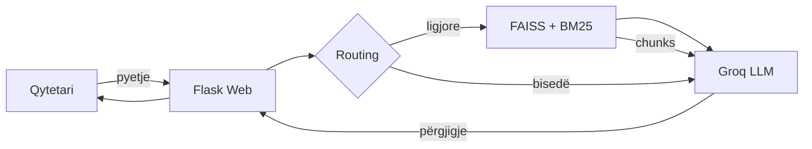

<div align="center">


# LIGJBOT

**Asistenti juridik shqiptar** — pyetje në gjuhë normale, përgjigje të qarta, burime nga ligjet.

<br/>

[](https://www.python.org/)
[](https://flask.palletsprojects.com/)
[](https://www.langchain.com/)
[](https://groq.com/)
[](LICENSE)

[Fillimi i shpejtë](#-fillimi-i-shpejtë) · [Funksionalitetet](#-funksionalitetet) · [Arkitektura](#-arkitektura) · [Deploy](#-deploy)

</div>

---

## Çfarë është LIGJBOT?

LIGJBOT është një asistent konversacional që ndihmon qytetarët shqiptarë të kuptojnë ligjet — gjoba, policinë, lejet, të drejtat dhe procedurat — **me fjalë të thjeshta**, jo si dokument zyrtar.

Përdor **RAG** (Retrieval-Augmented Generation): kërkon në ligjet e indeksuara, pastaj gjeneron përgjigje me burime të klikueshme (ligj, nen, faqe).

> **Shënim:** LIGJBOT është mjet informues. Verifiko gjithmonë informacionin me burimet e cituara.

---

## ✨ Funksionalitetet

| Funksioni | Përshkrimi |
|-----------|------------|
| 💬 **Chat konversacional** | Bisedë natyrale në shqip (dhe anglisht) — jo vetëm citim ligjesh |
| 📚 **RAG mbi ligje** | Kërkim semantik (FAISS) + hybrid BM25 mbi PDF-të shqiptare |
| 🔗 **Burime inline** | Linke direkte te neni dhe faqja në PDF |
| 📰 **Lajme rrugore** | Agregim RSS nga portale shqiptare |
| 🌓 **Dark / Light mode** | UI modern, responsive, PWA-ready |
| 🔐 **Multi-user** | Login me Google ose email (Firebase Auth + Firestore) |
| 📱 **Mobile** | Optimizuar për telefon; faqe QR për akses në WiFi lokal |

---

## 🏗 Arkitektura



**Stack kryesor**

- **Backend:** Python 3.11 · Flask · Gunicorn
- **Vektoret:** FAISS · HuggingFace `multilingual-e5-large`
- **LLM:** Groq `llama-3.3-70b-versatile`
- **Auth:** Firebase Authentication · Cloud Firestore
- **Frontend:** HTML · CSS · JavaScript (pa framework)

---

## 📁 Struktura e projektit

```
ligjbot/
├── data/
│   ├── pdfs/                  # Ligjet shqiptare (PDF)
│   ├── eval_questions.json    # Pyetje për evaluim RAG
│   └── README.md
├── scripts/
│   ├── ingestion.py           # PDF → FAISS index
│   ├── verify_store.py        # Kontroll indeksi
│   ├── evaluate_rag.py        # Evaluim cilësie
│   ├── start_production.sh    # Gunicorn (prod)
│   └── dev.sh                 # Nisje lokale
├── src/
│   ├── app.py                 # Flask — routes & API
│   ├── rag_core.py            # Motor RAG + LLM
│   ├── news_feed.py           # Lajme RSS
│   ├── online_ingest.py       # Ngarkim PDF në runtime
│   ├── static/                # Logo, manifest PWA
│   └── templates/             # HTML (chat, lajme, telefon)
├── tests/
│   └── test_rag.py
├── Dockerfile
├── render.yaml                # Deploy Render (Blueprint)
├── Procfile                   # Deploy Heroku/Railway
├── requirements.txt
├── start.sh                   # Wrapper → scripts/dev.sh
└── .env.example
```

---

## 🚀 Fillimi i shpejtë

### 1. Klonimi & varësitë

```bash
git clone https://github.com/frenk1j/ligjbot.git
cd ligjbot

python3 -m venv .venv
source .venv/bin/activate   # Windows: .venv\Scripts\activate
pip install -r requirements.txt
```

### 2. Konfigurimi

```bash
cp .env.example .env
```

Plotëso në `.env`:

| Variabla | E detyrueshme | Përshkrimi |
|----------|---------------|------------|
| `GROQ_API_KEY` | Po | Çelësi API nga [console.groq.com](https://console.groq.com) |
| `FIREBASE_*` | Jo | Për login multi-user (6 fusha nga Firebase Console) |
| `PUBLIC_BASE_URL` | Jo | URL publike kur deploy (pa `/` në fund) |

> **Mos commit-o kurrë skedarin `.env`** — përmban çelësa private.

### 3. Indeksimi i ligjeve (një herë)

```bash
python scripts/ingestion.py
python scripts/verify_store.py
```

### 4. Nisja

```bash
# Mënyra e shpejtë (hap edhe shfletuesin)
./start.sh

# Ose manualisht
python src/app.py
```

Hape: **http://localhost:5001**

---

## 🧪 Teste

```bash
# Teste automatike RAG
python tests/test_rag.py
python tests/test_rag.py --quick

# Evaluim cilësie me pyetje nga data/eval_questions.json
python scripts/evaluate_rag.py
```

---

## ☁️ Deploy

### Render (rekomanduar)

1. Push repo në GitHub
2. [Render Dashboard](https://render.com) → **New Blueprint** → zgjidh `render.yaml`
3. Vendos env vars (`GROQ_API_KEY`, `FIREBASE_*`, etj.)
4. Shto domain-in e deploy në Firebase → **Authorized domains**

### Docker

```bash
docker build -t ligjbot .
docker run -p 5001:5001 --env-file .env ligjbot
```

---

## 🔧 Variabla mjedisi

Shiko `.env.example` për listën e plotë. Më të rëndësishmet:

- `FAST_MODE=0` — përdor LLM të plotë (rekomandohet)
- `FAST_MODE=1` — vetëm kërkim, pa Groq (më i shpejtë, më pak konversacional)
- `LLM_MODEL` — modeli Groq (default: `llama-3.3-70b-versatile`)
- `VECTOR_STORE_PATH` — rrugë te indeksi FAISS

---

## 🤝 Kontribut

1. Fork repo-n
2. Krijo branch: `git checkout -b feature/emri`
3. Commit ndryshimet
4. Hap Pull Request

---

## 📄 Licenca

MIT — shiko [LICENSE](LICENSE).

---

<div align="center">

**LIGJBOT** · Ndihmë ligjore e thjeshtë për çdo qytetar


</div>
